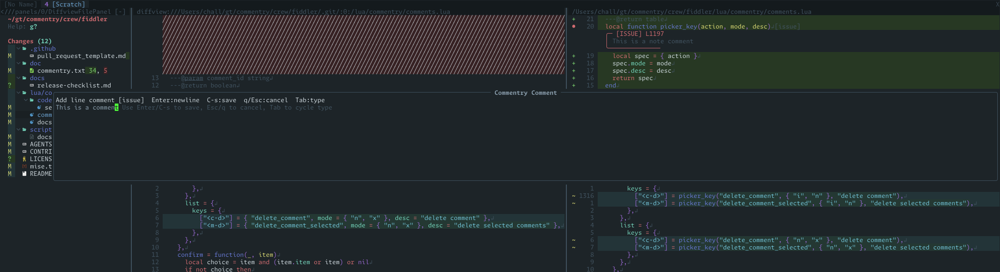

# commentry.nvim

Neovim plugin for local diff review workflows, draft persistence, and optional
Codex handoff from inside Neovim.

## Preview

Commentry inside Diffview with draft comments, type labels, and review context
visible in-place:



## Install

Using lazy.nvim:

```lua
{
  "commentry/commentry.nvim",
  dependencies = {
    "sindrets/diffview.nvim",
  },
  opts = {},
}
```

Required:

- Neovim `0.10+`
- `sindrets/diffview.nvim` for the diff UI

Optional integrations:

- `folke/snacks.nvim` for `:Commentry list-comments`
- a Sidekick runtime for `:Commentry send-to-codex`

## Setup

```lua
require("commentry").setup({
  log = {
    level = "warn", -- error|warn|info|debug
    sink = "notify", -- notify|echo|file
    file = nil, -- path when sink == "file"
  },
  diagnostics = {
    open_style = "split", -- split|vsplit|float
  },
  diffview = {
    auto_attach = true,
    comment_cards = {
      max_width = 88,
      max_body_lines = 8,
      show_markers = true,
    },
    comment_ranges = {
      enabled = true,
      line_highlight = true,
    },
  },
})
```

## Commands

`commentry.nvim` provides a `:Commentry` command with subcommands.

- `:Commentry open` opens a diffview for local changes (shortcut).
- `:Commentry add-range-comment` creates a range comment from the current visual selection.
- `:Commentry list-comments` opens a Snacks picker for draft comments on the current file/side, with source preview and in-picker delete (`<C-d>` current, `<M-d>` selected). Requires `snacks.nvim`.
- `:Commentry set-comment-type` sets default or per-comment type (`note`, `suggestion`, `issue`, `praise`).
- `:Commentry toggle-file-reviewed` toggles reviewed status for the current diff file.
- `:Commentry next-unreviewed` jumps to the next unreviewed diff file in panel order.
- `:Commentry export` prints deterministic markdown for active draft comments.
- `:Commentry export register` writes markdown to the unnamed register.
- `:Commentry export register:<name>` writes markdown to a specific register (for example `register:a`).
- `:Commentry debug-store` prints the active review context and the exact on-disk store path.
- `:Commentry diagnostics` opens a scratch buffer with runtime diagnostics (config/log/store/diffview state).
- `:Commentry send-to-codex` sends the current review payload to Codex using the attached Sidekick session target. Requires `codex.enabled = true` and an available Sidekick runtime.

If you open diffview directly (for example `:DiffviewOpen main`), Commentry will
auto-attach to diff buffers by default.

You can disable auto-attach with:

```lua
require("commentry").setup({
  diffview = {
    auto_attach = false,
  },
})
```

## Keymap Configuration

Commentry supports nine configurable diffview-local keymap actions:

| Action | Default | Mode | Empty-string disable (`""`) | Command fallback |
| --- | --- | --- | --- | --- |
| `add_comment` | `mc` | Normal | No | None |
| `add_range_comment` | `mc` | Visual | No | `:Commentry add-range-comment` |
| `edit_comment` | `me` | Normal | No | None |
| `delete_comment` | `md` | Normal | No | None |
| `set_comment_type` | `mt` | Normal | No | `:Commentry set-comment-type` |
| `toggle_file_reviewed` | `mr` | Normal | Yes | `:Commentry toggle-file-reviewed` |
| `next_unreviewed_file` | `]r` | Normal | Yes | `:Commentry next-unreviewed` |
| `send_to_codex` | `ms` | Normal | No | `:Commentry send-to-codex` |
| `list_comments` | `ml` | Normal | No | `:Commentry list-comments` |

Notes:

- Keymaps attach only in buffers marked as Commentry diffview buffers.
- Empty-string disable is intentionally scoped to `toggle_file_reviewed` and `next_unreviewed_file`.
- For remap-only actions (`add_comment`, `add_range_comment`, `edit_comment`, `delete_comment`, `set_comment_type`, `send_to_codex`, `list_comments`), `""` is invalid and setup warns, then default/effective mapping remains active.
- `add_range_comment` mapping normally uses its configured/default value from setup normalization. The fallback chain to resolved `add_comment` (then `mc`) is a defensive runtime path when `Config.keymaps` is missing or bypasses normalization.

Example override (partial remap + selective disable):

```lua
require("commentry").setup({
  keymaps = {
    add_comment = "gc",
    add_range_comment = "gc",
    edit_comment = "ge",
    delete_comment = "gd",
    set_comment_type = "gt",
    send_to_codex = "gs",
    list_comments = "gl",
    toggle_file_reviewed = "",
    next_unreviewed_file = "]u",
  },
})
```

Example keep defaults except one mapping:

```lua
require("commentry").setup({
  keymaps = {
    next_unreviewed_file = "]n",
  },
})
```

## Development

- Run tests: `./scripts/test`
- Validate docs: `./scripts/docs`
- First release checklist: `docs/release-checklist.md`
- Canonical feature/design plans: `docs/plans/`
- Legacy Speckit archive (read-only history): `docs/archive/speckit/`

## Behavior Notes

- Draft comments are persisted per review context under `~/.commentry/repos/<repo>/contexts/<context-id>/`.
- Review context identity is branch-scoped (`<root>::review::branch::<branch-name>`), so comments remain stable across
  different `:DiffviewOpen` range lenses on the same branch until anchors become outdated by code changes.
- Add/edit/range comment actions open a floating multiline editor (`Enter` for newline, `Ctrl-s` to save, `q`/`Esc` in normal mode to cancel, `Tab` to cycle type).
- Draft comment bodies are rendered as persistent boxed cards on commented lines, even when the cursor moves away.
- Range comments render start/mid/end gutter signs (`╭`, `│`, `╰`) with subtle line tinting to show covered lines.
- File reviewed state is tracked per context and rendered as a lightweight `[reviewed]` / `[unreviewed]` indicator in diff buffers.
- Send flow is explicit: open/attach a review (`:Commentry open` or auto-attach), ensure Codex integration is enabled, then run
  `:Commentry send-to-codex`.
- Adapter behavior is global/implicit in v1. `send-to-codex` discovers existing Sidekick Codex sessions:
  auto-attaches when exactly one exists, auto-selects when exactly one matches current cwd, uses the Sidekick picker when multiple remain, and fails when none exist.
- `send-to-codex` requires an attached active review context. Running it outside an attached review buffer/context fails.
- Send is send-and-forget in v1: Commentry dispatches a compact human-readable payload (`COMMENTRY_REVIEW_V1`) once
  and reports success/failure in Neovim messages.
- v1 does not persist send history, delivery receipts, retries, or any outbound queue state.

## Bug Reports

Use the minimal repro config to isolate issues:

```bash
nvim --clean -u repro.lua
```

This bootstraps a clean Neovim with only commentry + diffview loaded.

## Troubleshooting

- Draft store file does not exist yet:
  Commentry creates `~/.commentry/repos/<repo>/contexts/<context-id>/commentry.json` lazily on first successful write
  (add/edit/delete comment, set type, toggle reviewed). If no writes happened in that context yet, the file is absent.
- `:Commentry list-comments` is unavailable:
  install `snacks.nvim`, then rerun `:checkhealth commentry` to confirm `picker.select` support.
- Wrong context:
  review context is branch-scoped (`<root>::review::branch::<branch-name>`) and shared across diff ranges on that branch.
  Comments become stale/outdated
  when anchor reconciliation detects code drift. Use `:Commentry debug-store` to confirm the active context id/path.
- Sidekick send target not found:
  ensure at least one existing Codex Sidekick session is available, then run `:Commentry send-to-codex` from an attached review buffer/context.
